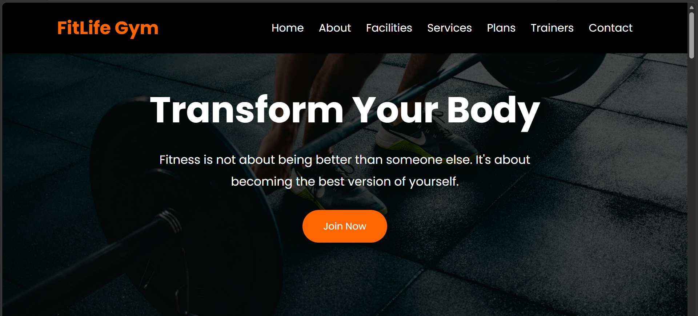

# CrixsoftSolution_GymWebsite

## Gym Website

This project is a responsive Gym Website developed using HTML, CSS, and JavaScript as part of the Crixsoft Solution Web Development Internship.

## Features

- Responsive Design
- Home Section
- About Section
- Facilities Section
- Services Section
- Membership Plans
- Trainers Section
- Contact Section
- Smooth Scrolling Navigation

## Technologies Used

- HTML5
- CSS3
- JavaScript

## Project Screenshot

> Upload your output image to the repository with the name **GymWebsite_Output.png** and then replace the line below by removing the `>`.

# CrixsoftSolution_GymWebsite

## Gym Website

This project is a responsive Gym Website developed using HTML, CSS, and JavaScript as part of the Crixsoft Solution Web Development Internship.

## Features

- Responsive Design
- Home Section
- About Section
- Facilities Section
- Services Section
- Membership Plans
- Trainers Section
- Contact Section
- Smooth Scrolling Navigation

## Technologies Used

- HTML5
- CSS3
- JavaScript

## Project Screenshot

> Upload your output image to the repository with the name **GymWebsite_Output.png** and then replace the line below by removing the `>`.
##Output

## Author
Lakshmilavanya

##  Internship
Web Development Internship - Crixsoft Solution
